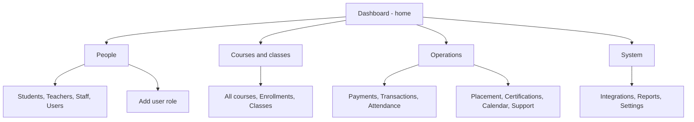

# Admin area — user guide

This document explains **what each admin screen is for** and **what happens when you use it**.  
Most actions are **demonstrations** (they show a message but do not call a real server yet). The **All courses** list and parts of the **home dashboard** can load from the API when you are signed in.

---

## 1. How the admin area is organized

Think of **five areas** in the sidebar:

| Area | What it is for |
| ---- | ---------------- |
| **Home** | One overview page with shortcuts. |
| **People** | Students, teachers, staff, user list, adding a role. |
| **Courses & classes** | Catalog, enrollments, class sections. |
| **Operations** | Payments, ledger, attendance, tests, certificates, calendar, support. |
| **System** | Integrations, reports, settings. |

**Big picture** (start at the dashboard, then open a section):

**Every inner page** has **Back to dashboard** at the top → returns to `/dashboard/admin`.

---

## 2. Menu: label → URL

Use this as a lookup table.

**Home**

- **Dashboard** → `/dashboard/admin`

**People**

- **Students & registrations** → `/dashboard/admin/students`
- **Teachers** → `/dashboard/admin/teachers`
- **Staff** → `/dashboard/admin/staff`
- **Users** → `/dashboard/admin/users`
- **Add user role** → `/dashboard/admin/add-user-role`

**Courses & classes**

- **All courses** → `/dashboard/admin/courses`
- **Enrollments & waitlist** → `/dashboard/admin/enrollments`
- **Classes & rosters** → `/dashboard/admin/classes`

**Operations**

- **Payments & reminders** → `/dashboard/admin/payments`
- **Transactions** → `/dashboard/admin/transactions`
- **Attendance & progress** → `/dashboard/admin/attendance`
- **Placement tests** → `/dashboard/admin/placement-tests`
- **Certifications** → `/dashboard/admin/certifications`
- **Calendar** → `/dashboard/admin/calendar`
- **Support sessions** → `/dashboard/admin/support-sessions`

**System**

- **Integrations** → `/dashboard/admin/integrations`
- **Reports** → `/dashboard/admin/reports`
- **Settings** → `/dashboard/admin/settings`

---

## 3. Page-by-page: what you see and what happens

### Dashboard (`/dashboard/admin`)

**What it is:** Admin home. Summary numbers, a recent users table, activity feed, and quick links.

**What you can do:**

1. Read the **stat cards** at the top (numbers come from the API when available).
2. Use **search and filters** on **Recent Users** to narrow the table.
3. Open the **⋯** menu on a user row — options are **placeholders** (they do not open other pages yet).
4. Use **Quick Actions** to jump to common places (students, enrollments, payments, courses, calendar, users, reports, settings).
5. Read **System activity** as a static list.

**Demo note:** The **Add User** button in the Recent Users header is not wired to the “Add user role” page in code; use the sidebar **Add user role** if you need that screen.

---

### Students & registrations (`/dashboard/admin/students`)

**What it is:** A directory of students with status, trial use, course count, and warning flags.

**Typical flow:**

1. Filter by **status** or **search** by name or email.
2. Tick rows and click **Remind selected** — you get a short **demo** confirmation (no email is sent).

**Row menu (⋯):**

- **View enrollments** — goes to the enrollments page with `?student=…` in the URL. The enrollments screen does **not** auto-filter by that student yet; you still search manually there.
- **View profile** — shows a **demo** message only.

---

### Teachers (`/dashboard/admin/teachers`)

**What it is:** Lecturers, how many courses they teach, total students, and status.

**Typical flow:**

1. Filter by **active/inactive**, **course load**, or **search**.
2. Click **View profile** — a panel opens with details and a list **Courses taught** (each line shows **enrolled / capacity**, e.g. `16/32`).
3. Click **View details** on a course — you go to **All courses** with search prefilled; the dialog closes. If the course id from the list matches a real course from the API, that row may be highlighted.

---

### Staff (`/dashboard/admin/staff`)

**What it is:** Non-teaching staff list.

**Typical flow:** Search and filter by **role** and **status**. Table is read-only.

---

### Users (`/dashboard/admin/users`)

**What it is:** A cross-role list of users (demo data).

**Typical flow:** Search and filter by **role** and **status**. Table is read-only.

---

### Add user role (`/dashboard/admin/add-user-role`)

**What it is:** A small form to assign a role to someone by email.

**Typical flow:**

1. Enter **email** and choose **role** (student, teacher, staff).
2. Click **Submit** — **demo** success message (no API call).

---

### All courses (`/dashboard/admin/courses`)

**What it is:** Full catalog for admins — including **draft** courses when the API returns them (the app merges the default list with a `status=DRAFT` request when that query is supported).

**End-to-end flow (teacher → admin):**

1. **Teacher** creates a course (saved as **DRAFT**). They **do not set price** (pricing is admin-only). They **cannot** self-publish; the card shows **Awaiting admin approval**.
2. **Admin** opens **All courses**, finds **Draft** rows (filter: *Draft (pending review)*), and clicks **Review & publish**.
3. In the dialog, the admin enters **catalog price** (UZS), optional **referral code**, and **referral discount** (0–100%), then clicks **Publish course** — calls the API **publish** endpoint and stores price + code + discount in **browser sessionStorage** until billing exists on the server.
4. The course becomes **Published** for students; the table shows **Catalog price**, **Referral**, **Discount**, and **Discounted price** (computed from catalog price minus the %) for admins. While editing, the dialog shows a live **discounted price** preview when discount is above 0%.

**Other actions:**

- **View** on a published course opens the same dialog to **adjust the recorded price** (still sessionStorage).
- Use **search** and **status / category** filters.
- Optional URL: `?q=` prefills search; `?courseId=` can highlight a row.

---

### Enrollments & waitlist (`/dashboard/admin/enrollments`)

**What it is:** Rows that tie a student to a course and class, plus payment and class status. Waitlisted rows show a position number.

**Typical flow:**

1. Filter by **payment**, **enrollment**, or **class** status, or use **search**.
2. For **waitlist** rows only, use the checkbox to select lines.
3. Click **Promote selected from waitlist** — **demo** message (no server update).

---

### Classes & rosters (`/dashboard/admin/classes`)

**What it is:** Class sections with schedule, capacity (e.g. filled vs max), session quota bar, and status.

**Typical flow:**

1. Filter by **class status** or **course**, or search.
2. Click **Open roster** — **demo** message (there is no separate roster screen yet).

---

### Payments & reminders (`/dashboard/admin/payments`)

**What it is:** Invoice-style rows: student, course, lecturer, amount, status.

**Typical flow:**

1. Filter or search. You can tick rows and use **Remind selected** (demo).
2. **View details** — opens a panel with full fields. If a proof was uploaded, you can open **Open proof**, then **Approve proof** (demo).
3. **Mark paid** (only if not already paid):
   - Step 1: A **confirmation** dialog appears.
   - Step 2: If you confirm, this **browser session** marks that row as paid and sets a paid date. A success message appears. The row updates until you refresh the page (then mock data resets unless backed by API).

---

### Transactions (`/dashboard/admin/transactions`)

**What it is:** A simple ledger of recorded movements (demo data).

**Typical flow:** Filter by **type** and **method**, search. Read-only.

---

### Attendance & progress (`/dashboard/admin/attendance`)

**What it is:** Per-student attendance %, progress %, and risk flag.

**Typical flow:**

1. Filter by **at risk / on track**, **lecturer**, or search.
2. **View details** — opens a panel with class, lecturer, session counts, bars, and a **recent sessions** table.

---

### Placement tests (`/dashboard/admin/placement-tests`)

**What it is:** Placement quiz results with score and pass/fail (demo).

**Typical flow:** Filter by **result**, **course**, **lecturer**, or search. Read-only table.

---

### Certifications (`/dashboard/admin/certifications`)

**What it is:** Who might receive a certificate based on survey and course completion (demo).

**Typical flow:** Filter by **eligibility** and **course**. **Issue certificate** only works when the row is eligible — then a **demo** success message appears.

---

### Calendar (`/dashboard/admin/calendar`)

**What it is:** A list of events (classes, tests, reviews) with times (demo).

**Typical flow:** Filter by **event type** or search. Read-only list (not a full calendar grid).

---

### Support sessions (`/dashboard/admin/support-sessions`)

**What it is:** Extra help sessions requested by students (demo).

**Typical flow:**

- If status is **Requested**, **Approve & schedule** shows a **demo** message.
- If **Scheduled**, **View slot** shows a **demo** message.

---

### Integrations (`/dashboard/admin/integrations`)

**What it is:** Shows an **LMS base URL** (read-only field) with a button to open it in a new tab, plus short **free trial** policy text.

---

### Reports (`/dashboard/admin/reports`)

**What it is:** Placeholder KPI numbers (demo only). No exports yet.

---

### Settings (`/dashboard/admin/settings`)

**What it is:** A few **switches** (e.g. email on new registration, block LMS when payment is overdue).

**Typical flow:** Change switches, click **Save changes** — **demo** message (not persisted to a server).

---

## 4. Jumps between pages (shortcuts)

| From | Action | Goes to |
| ---- | ------ | ------- |
| Teachers → course **View details** | Link | All courses, with query params |
| Students → **View enrollments** | Link | Enrollments (student filter in URL **not applied in UI yet**) |
| Dashboard **Quick Actions** | Links | Various admin routes |

---

## 5. “Demo” vs “live data” (simple)

- **Live or mixed:** Dashboard stats (when API responds), **All courses** list and **publish** action from API.
- **Browser-only until backend exists:** **Catalog price**, **referral code**, and **referral discount %** on the admin courses screen (`sessionStorage` via `adminCourseCatalog`).
- **Demo / mock:** Almost all other admin tables, toasts, reminders, promotions, roster, certificates, support approval, settings save.
- **Mark paid:** Updates only **until you refresh** the page (in-memory), unless you later connect a real payments API.

---

## 6. Technical reference (for developers)

| Item | Detail |
| ---- | ------ |
| Menu config | `src/features/layout/navigation.ts` → `adminMenuItems` |
| Routes | `src/app/AppRoutes.tsx` — paths under `/dashboard/admin/…` |
| Mock data | `src/features/admin/data/adminOperationalMock.ts` |
| Layout wrapper | `AdminLayout` on feature pages; dashboard uses `DashboardSidebar` directly |
| Course review / catalog | `src/features/admin/components/AdminCourseReviewDialog.tsx`, `src/features/admin/utils/adminCourseCatalog.ts` |
