# EduHub — Flow Map

Sequence diagrams showing how **Student**, **Teacher**, and **Admin** interact.

> **View diagrams:** Open **[flow-map.html](./flow-map.html)** in your browser (Chrome/Safari).  
> The `.md` file below is source text — **Cursor/VS Code markdown preview does not render Mermaid.**

> **Step-by-step detail:** [user-flows.md](./user-flows.md) · **Client guide:** [platform-guide.md](./platform-guide.md)

---

## Table of contents

- [Full journey (all roles)](#full-journey-all-roles)
- [Student register](#student-register)
- [Teacher register (account setup)](#teacher-register-account-setup)
- [Admin register (account setup)](#admin-register-account-setup)
- [Student sign in](#student-sign-in)
- [Teacher create class](#teacher-create-class)
- [Student enroll in class](#student-enroll-in-class)
- [Student pay tuition](#student-pay-tuition)
- [Student attend class](#student-attend-class)
- [Student complete course & certificate](#student-complete-course--certificate)
- [Teacher teach class](#teacher-teach-class)
- [Teacher request payroll](#teacher-request-payroll)
- [Teacher substitute cover](#teacher-substitute-cover)
- [Admin approve enrollment](#admin-approve-enrollment)
- [Admin propose schedule](#admin-propose-schedule)
- [Teacher approve schedule](#teacher-approve-schedule)
- [Admin confirm payment](#admin-confirm-payment)
- [Admin approve payroll](#admin-approve-payroll)

---

## Full journey (all roles)

One class from start to finish — everyone together.

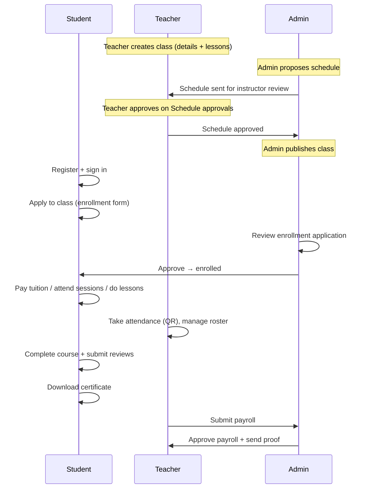
```mermaid
sequenceDiagram
    participant S as Student
    participant T as Teacher
    participant A as Admin

    Note over T: Teacher creates class (details + lessons)
    Note over A: Admin proposes schedule
    A->>T: Schedule sent for instructor review
    Note over T: Teacher approves on Schedule approvals
    T->>A: Schedule approved
    Note over A: Admin publishes class
    S->>S: Register + sign in
    S->>S: Apply to class (enrollment form)
    A->>A: Review enrollment application
    A->>S: Approve → enrolled
    S->>S: Pay tuition / attend sessions / do lessons
    T->>T: Take attendance (QR), manage roster
    S->>S: Complete course + submit reviews
    S->>S: Download certificate
    T->>A: Submit payroll
    A->>T: Approve payroll + send proof
```

---

## Student register

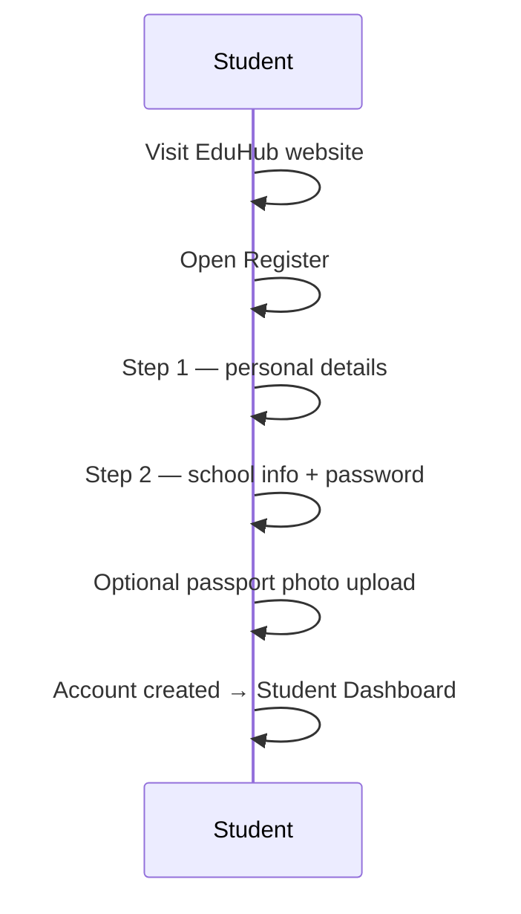
```mermaid
sequenceDiagram
    participant S as Student

    S->>S: Visit EduHub website
    S->>S: Open Register
    S->>S: Step 1 — personal details
    S->>S: Step 2 — school info + password
    S->>S: Optional passport photo upload
    S->>S: Account created → Student Dashboard
```

---

## Teacher register (account setup)

Teachers cannot self-register. Admin creates the account first.

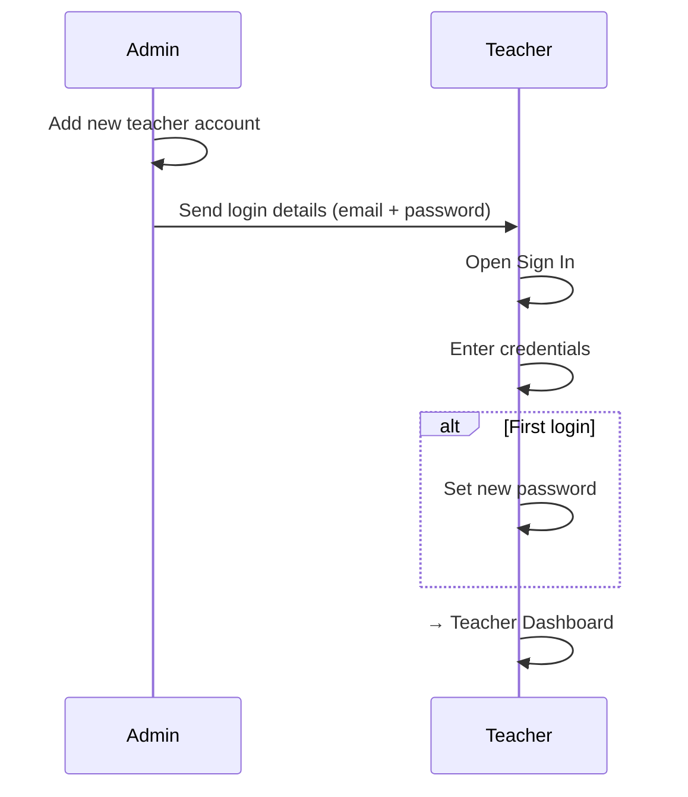
```mermaid
sequenceDiagram
    participant A as Admin
    participant T as Teacher

    A->>A: Add new teacher account
    A->>T: Send login details (email + password)
    T->>T: Open Sign In
    T->>T: Enter credentials
    alt First login
        T->>T: Set new password
    end
    T->>T: → Teacher Dashboard
```

---

## Admin register (account setup)

Admin staff accounts are also created by a super admin.

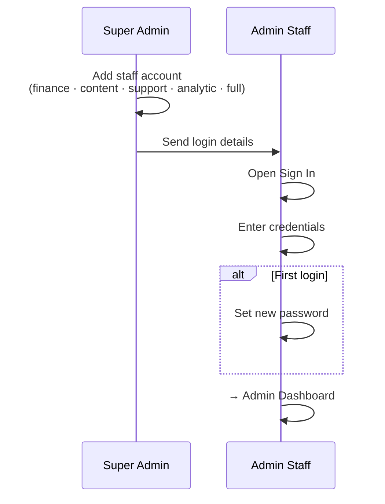
```mermaid
sequenceDiagram
    participant SA as Super Admin
    participant A as Admin Staff

    SA->>SA: Add staff account<br/>(finance · content · support · analytic · full)
    SA->>A: Send login details
    A->>A: Open Sign In
    A->>A: Enter credentials
    alt First login
        A->>A: Set new password
    end
    A->>A: → Admin Dashboard
```

---

## Student sign in

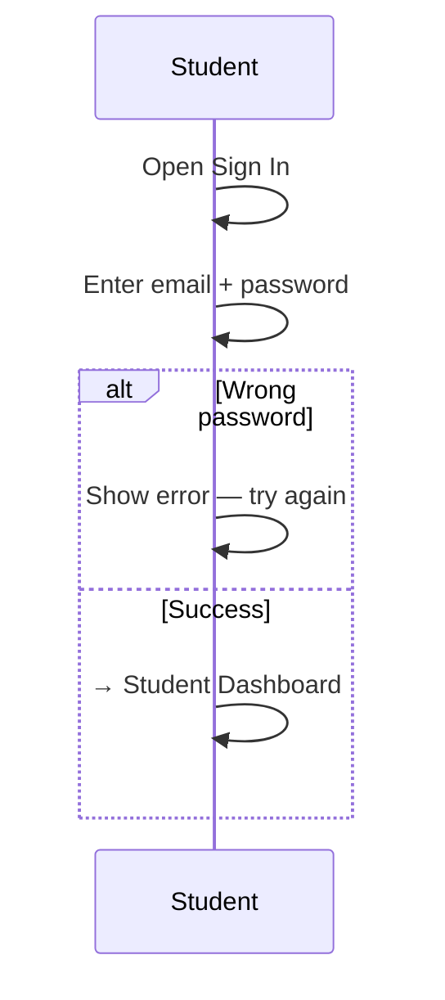
```mermaid
sequenceDiagram
    participant S as Student

    S->>S: Open Sign In
    S->>S: Enter email + password
    alt Wrong password
        S->>S: Show error — try again
    else Success
        S->>S: → Student Dashboard
    end
```

---

## Forgot password

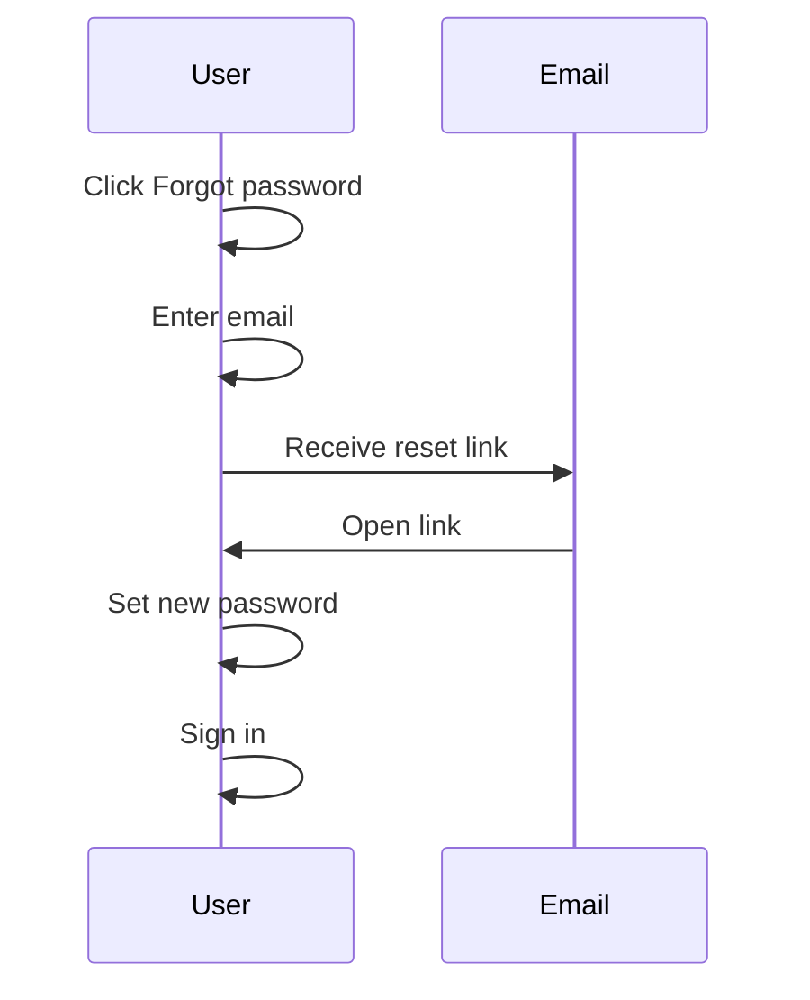
```mermaid
sequenceDiagram
    participant U as User
    participant E as Email

    U->>U: Click Forgot password
    U->>U: Enter email
    U->>E: Receive reset link
    E->>U: Open link
    U->>U: Set new password
    U->>U: Sign in
```

---

## Teacher create class

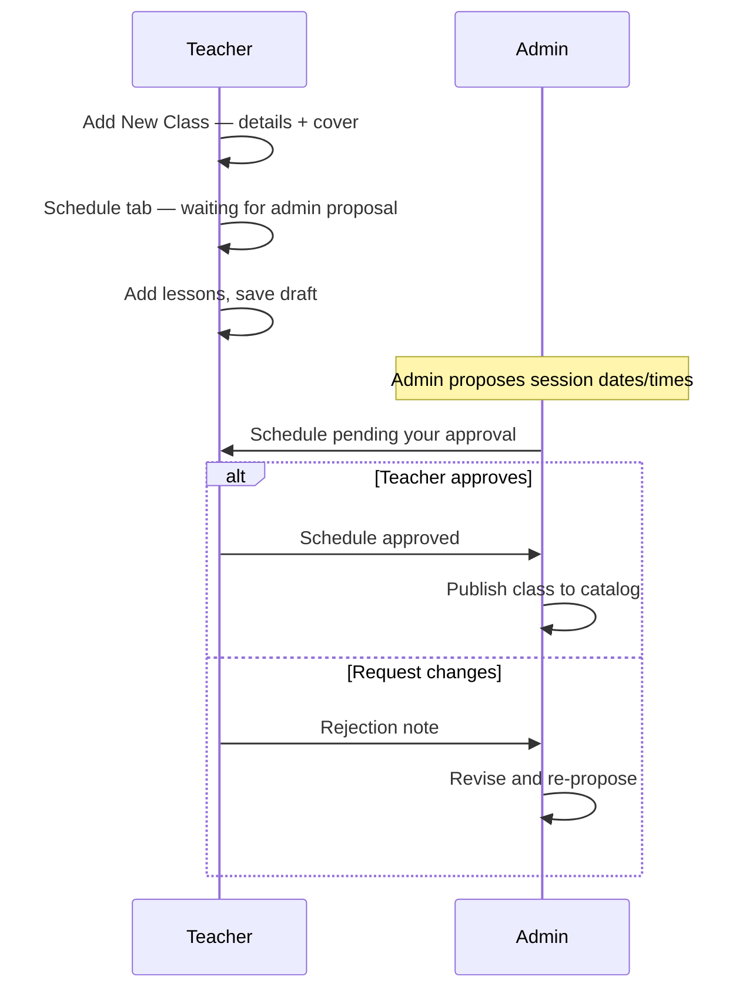
```mermaid
sequenceDiagram
    participant T as Teacher
    participant A as Admin

    T->>T: Add New Class — details + cover
    T->>T: Schedule tab — waiting for admin proposal
    T->>T: Add lessons, save draft
    Note over A: Admin proposes session dates/times
    A->>T: Schedule pending your approval
    alt Teacher approves
        T->>A: Schedule approved
        A->>A: Publish class to catalog
    else Request changes
        T->>A: Rejection note
        A->>A: Revise and re-propose
    end
```

---

## Student enroll in class

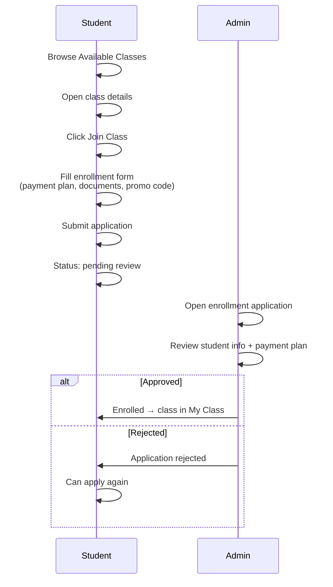
```mermaid
sequenceDiagram
    participant S as Student
    participant A as Admin

    S->>S: Browse Available Classes
    S->>S: Open class details
    S->>S: Click Join Class
    S->>S: Fill enrollment form<br/>(payment plan, documents, promo code)
    S->>S: Submit application
    S->>S: Status: pending review
    A->>A: Open enrollment application
    A->>A: Review student info + payment plan
    alt Approved
        A->>S: Enrolled → class in My Class
    else Rejected
        A->>S: Application rejected
        S->>S: Can apply again
    end
```

---

## Student pay tuition

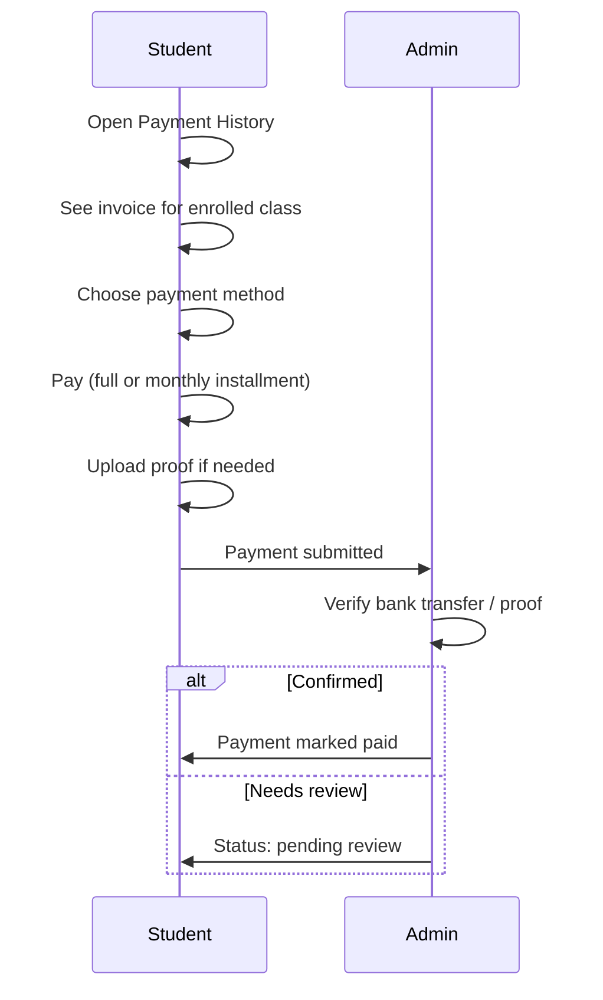
```mermaid
sequenceDiagram
    participant S as Student
    participant A as Admin

    S->>S: Open Payment History
    S->>S: See invoice for enrolled class
    S->>S: Choose payment method
    S->>S: Pay (full or monthly installment)
    S->>S: Upload proof if needed
    S->>A: Payment submitted
    A->>A: Verify bank transfer / proof
    alt Confirmed
        A->>S: Payment marked paid
    else Needs review
        A->>S: Status: pending review
    end
```

---

## Student attend class

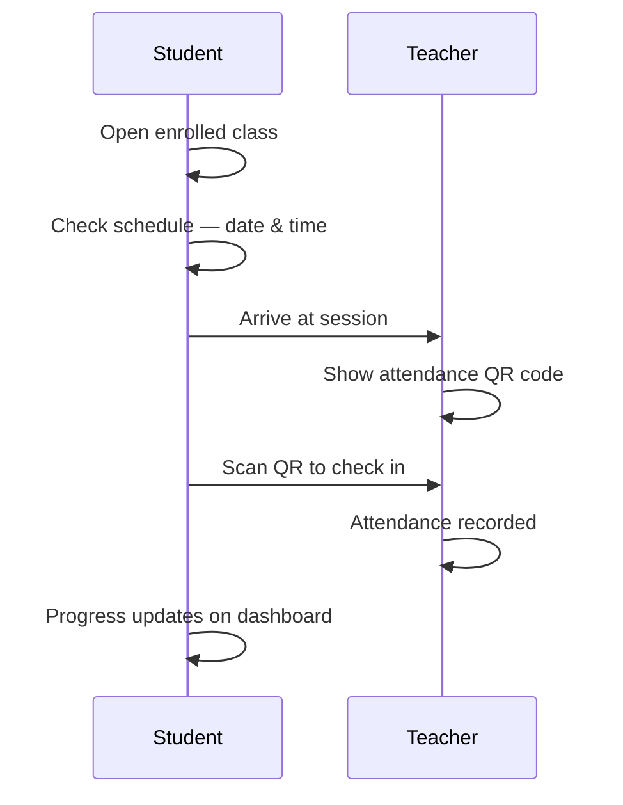
```mermaid
sequenceDiagram
    participant S as Student
    participant T as Teacher

    S->>S: Open enrolled class
    S->>S: Check schedule — date & time
    S->>T: Arrive at session
    T->>T: Show attendance QR code
    S->>T: Scan QR to check in
    T->>T: Attendance recorded
    S->>S: Progress updates on dashboard
```

---

## Student complete course & certificate

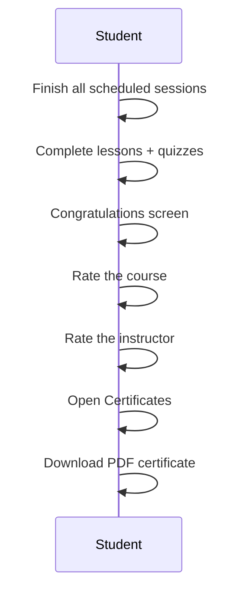
```mermaid
sequenceDiagram
    participant S as Student

    S->>S: Finish all scheduled sessions
    S->>S: Complete lessons + quizzes
    S->>S: Congratulations screen
    S->>S: Rate the course
    S->>S: Rate the instructor
    S->>S: Open Certificates
    S->>S: Download PDF certificate
```

---

## Teacher teach class

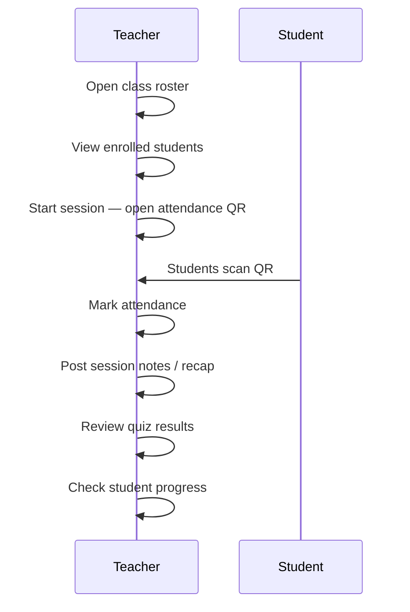
```mermaid
sequenceDiagram
    participant T as Teacher
    participant S as Student

    T->>T: Open class roster
    T->>T: View enrolled students
    T->>T: Start session — open attendance QR
    S->>T: Students scan QR
    T->>T: Mark attendance
    T->>T: Post session notes / recap
    T->>T: Review quiz results
    T->>T: Check student progress
```

---

## Teacher request payroll

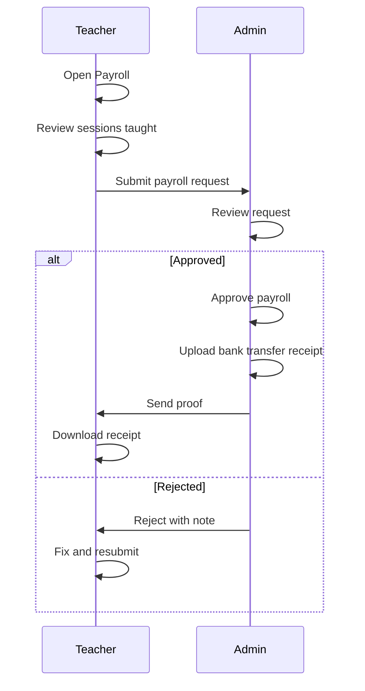
```mermaid
sequenceDiagram
    participant T as Teacher
    participant A as Admin

    T->>T: Open Payroll
    T->>T: Review sessions taught
    T->>A: Submit payroll request
    A->>A: Review request
    alt Approved
        A->>A: Approve payroll
        A->>A: Upload bank transfer receipt
        A->>T: Send proof
        T->>T: Download receipt
    else Rejected
        A->>T: Reject with note
        T->>T: Fix and resubmit
    end
```

---

## Teacher substitute cover

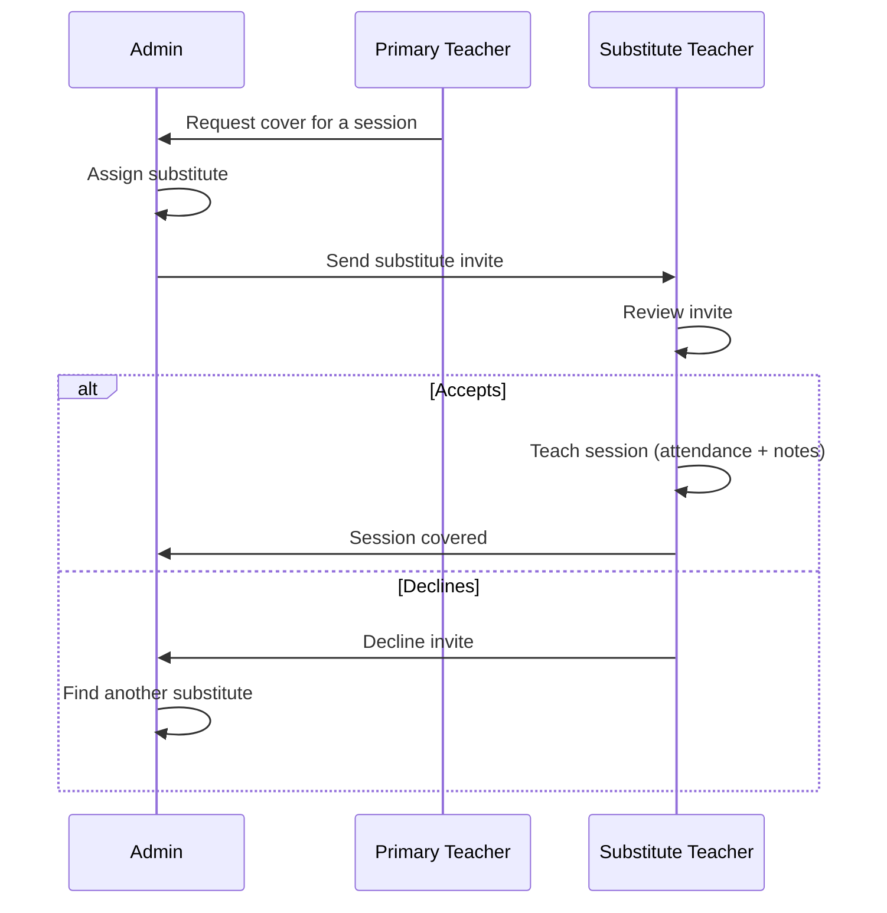
```mermaid
sequenceDiagram
    participant A as Admin
    participant T1 as Primary Teacher
    participant T2 as Substitute Teacher

    T1->>A: Request cover for a session
    A->>A: Assign substitute
    A->>T2: Send substitute invite
    T2->>T2: Review invite
    alt Accepts
        T2->>T2: Teach session (attendance + notes)
        T2->>A: Session covered
    else Declines
        T2->>A: Decline invite
        A->>A: Find another substitute
    end
```

---

## Admin approve enrollment

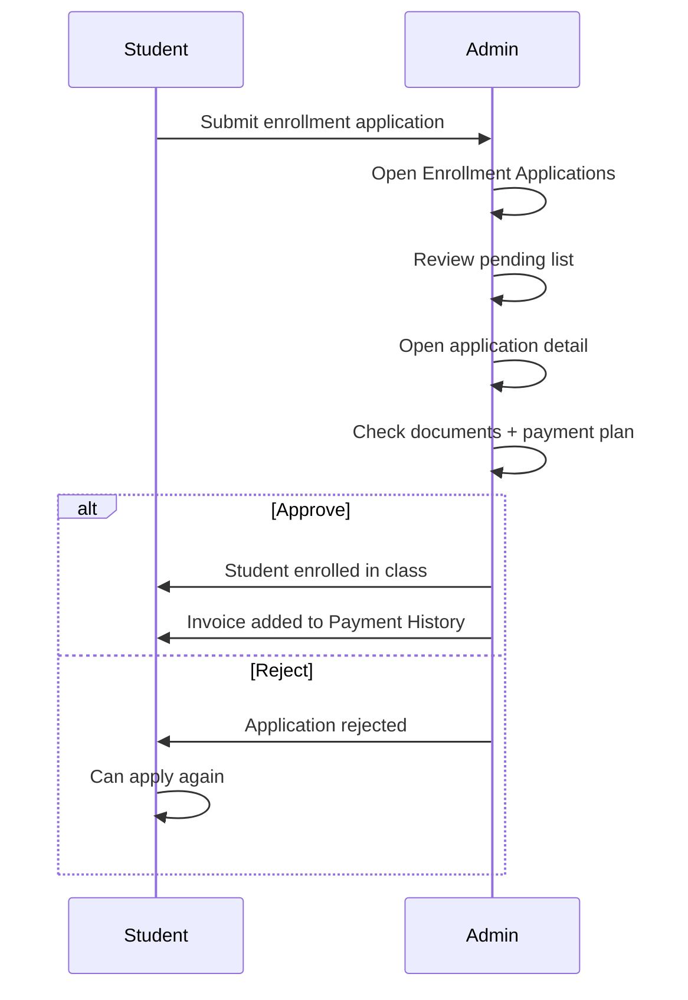
```mermaid
sequenceDiagram
    participant S as Student
    participant A as Admin

    S->>A: Submit enrollment application
    A->>A: Open Enrollment Applications
    A->>A: Review pending list
    A->>A: Open application detail
    A->>A: Check documents + payment plan
    alt Approve
        A->>S: Student enrolled in class
        A->>S: Invoice added to Payment History
    else Reject
        A->>S: Application rejected
        S->>S: Can apply again
    end
```

---

## Admin propose schedule

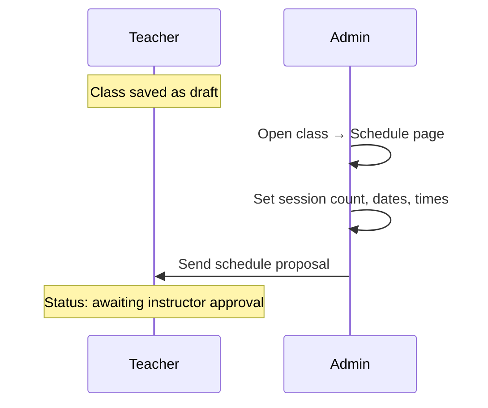
```mermaid
sequenceDiagram
    participant T as Teacher
    participant A as Admin

    Note over T: Class saved as draft
    A->>A: Open class → Schedule page
    A->>A: Set session count, dates, times
    A->>T: Send schedule proposal
    Note over T: Status: awaiting instructor approval
```

---

## Teacher approve schedule

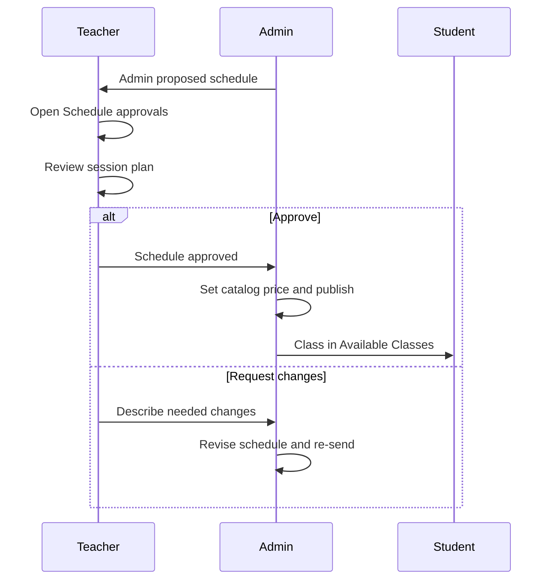
```mermaid
sequenceDiagram
    participant T as Teacher
    participant A as Admin
    participant S as Student

    A->>T: Admin proposed schedule
    T->>T: Open Schedule approvals
    T->>T: Review session plan
    alt Approve
        T->>A: Schedule approved
        A->>A: Set catalog price and publish
        A->>S: Class in Available Classes
    else Request changes
        T->>A: Describe needed changes
        A->>A: Revise schedule and re-send
    end
```

---

## Admin confirm payment

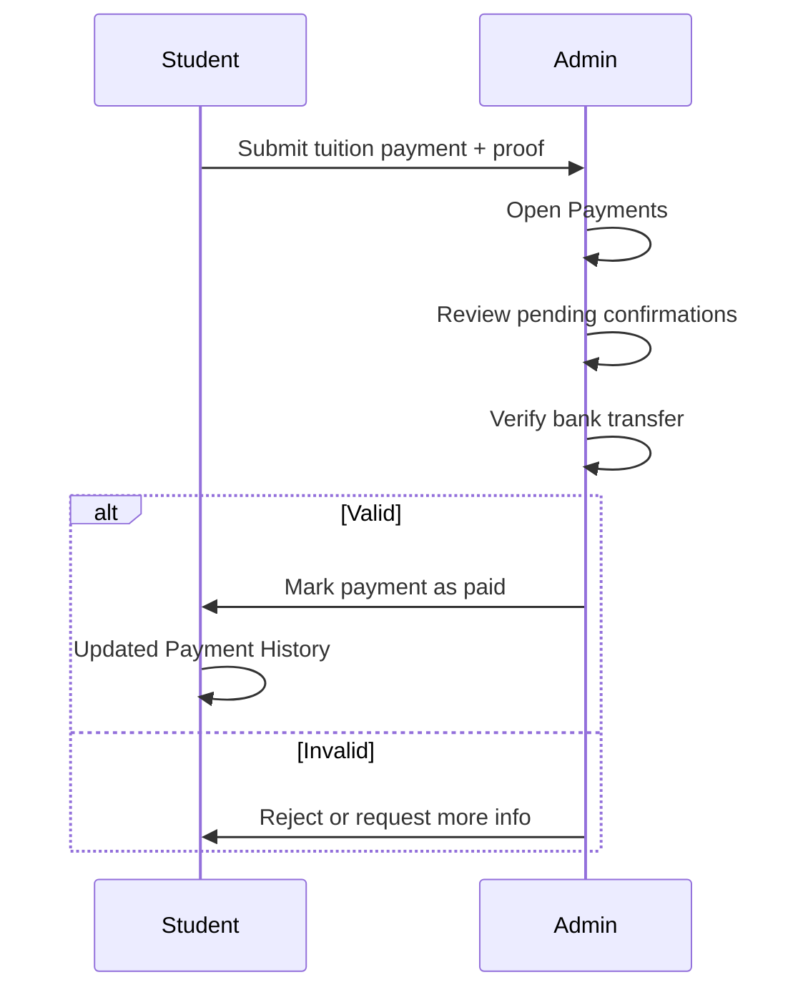
```mermaid
sequenceDiagram
    participant S as Student
    participant A as Admin

    S->>A: Submit tuition payment + proof
    A->>A: Open Payments
    A->>A: Review pending confirmations
    A->>A: Verify bank transfer
    alt Valid
        A->>S: Mark payment as paid
        S->>S: Updated Payment History
    else Invalid
        A->>S: Reject or request more info
    end
```

---

## Admin approve payroll

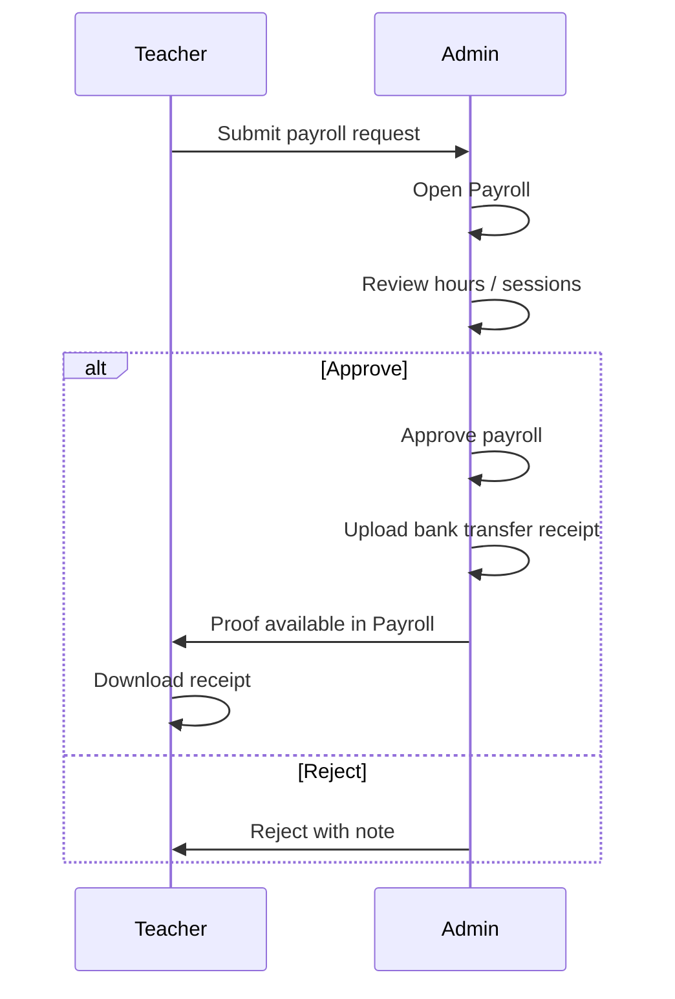
```mermaid
sequenceDiagram
    participant T as Teacher
    participant A as Admin

    T->>A: Submit payroll request
    A->>A: Open Payroll
    A->>A: Review hours / sessions
    alt Approve
        A->>A: Approve payroll
        A->>A: Upload bank transfer receipt
        A->>T: Proof available in Payroll
        T->>T: Download receipt
    else Reject
        A->>T: Reject with note
    end
```

---

## Quick reference — who talks to whom

| Flow | Student | Teacher | Admin |
|------|---------|---------|-------|
| Register (self) | ✅ alone | — | — |
| Get account | — | ← Admin | ← Super Admin |
| Create class | — | → Admin | reviews |
| Enroll | → Admin | — | approves → Student |
| Pay tuition | → Admin | — | confirms → Student |
| Attend | ↔ Teacher | ↔ Student | — |
| Certificate | ✅ alone | — | — |
| Payroll | — | → Admin | approves → Teacher |
| Substitute | — | ↔ Admin ↔ Substitute | assigns |

---

*EduHub — Termez University of Economics and Service (TUES)*
