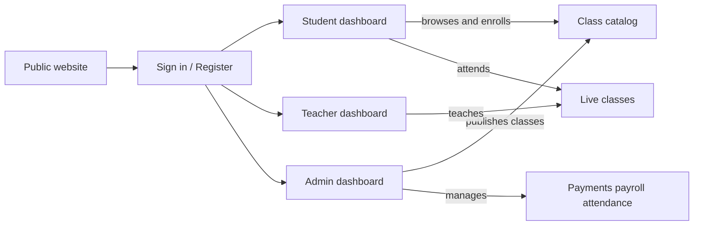
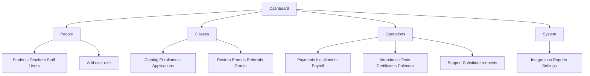
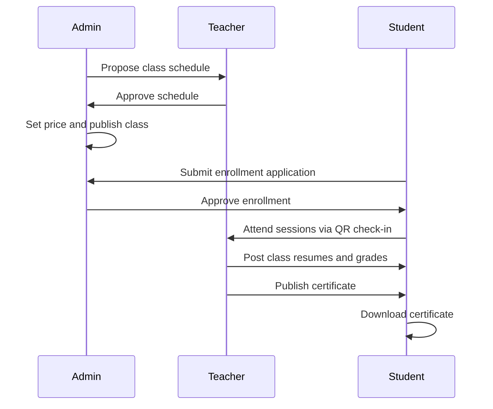

# EduHub Platform Guide

A client-facing overview of the EduHub learning platform — what it is, who uses it, and how students, teachers, and administrators work together from class creation through certification.

---

## 1. What is EduHub?

**EduHub** is the official Learning Management System (LMS) for the **Termez University of Economics and Service (TUES)**. It brings together online and in-person education in one place: class catalog, enrollment and payments, live attendance, learning content, assessments, certificates, and administrative operations.

The platform serves three types of users:

| Role | Who they are | What they do on EduHub |
|------|--------------|------------------------|
| **Student** | Learners enrolled at TUES | Browse classes, enroll, attend sessions, complete lessons, take quizzes, and earn certificates |
| **Teacher** | Lecturers and instructors | Create and teach classes, run attendance, post session notes, grade students, and manage payroll |
| **Administrator** | TUES operations staff | Manage people, publish classes, approve enrollments, handle payments and payroll, and oversee the platform |

**Languages:** The interface supports **English**, **Uzbek**, **Russian**, and **Chinese**. Each user can set their preferred language in Settings.

---

## 2. Platform at a glance

EduHub connects the public website, three role-based dashboards, and shared workflows for classes, payments, and completion.

**How the pieces fit together:**

- **Administrators** set up classes, approve enrollments, and manage finances and operations.
- **Teachers** design course content, deliver sessions, and assess student progress.
- **Students** discover classes, pay tuition, learn, and receive certificates when they complete a course.

Every signed-in user lands on a dashboard tailored to their role. Navigation, notifications, and workflows are organized around what each role needs to accomplish day to day.

---

## 3. Public website

Before signing in, visitors see the **EduHub marketing homepage**. It introduces the platform and encourages registration.

**What visitors see:**

- A hero section highlighting online classes, expert instructors, and career growth
- Platform features and benefits
- Instructor team profiles
- Student testimonials and reviews
- Calls to action to **Sign in** or **Register**

**Getting started as a new student:**

1. Visit the homepage and click **Register**.
2. Create an account with name, email, and password.
3. Verify your email address using the link sent to your inbox.
4. Sign in and arrive at your student dashboard.

Returning users click **Sign in** and are taken directly to the dashboard for their role (student, teacher, or administrator).

---

## 4. Authentication

EduHub provides standard account management for all users.

| Action | Purpose |
|--------|---------|
| **Sign in** | Log in with email and password; redirected to the correct dashboard by role |
| **Register** | Create a new student account |
| **Verify email** | Confirm email address after registration |
| **Forgot password** | Request a password reset link by email |
| **Reset password** | Set a new password from the reset link |
| **Change password** | Update password (e.g. after first login or when required) |

After signing in:

- **Students** go to the student dashboard
- **Teachers** go to the teacher dashboard
- **Administrators** go to the admin dashboard

---

## 5. Student experience

The student dashboard is the home base for learning. The sidebar provides quick access to every major area.

### Navigation overview

| Menu item | What it is for |
|-----------|----------------|
| **Dashboard** | Overview of enrolled classes, upcoming schedule, and quick links |
| **My Class** | All classes you are enrolled in — lessons, progress, and session notes |
| **Available Classes** | Browse the class catalog and apply to enroll |
| **Payment history** | Tuition payments, receipts, and outstanding balances |
| **Quiz** | Course quizzes and placement tests |
| **Certificates** | Download completion certificates for finished courses |
| **Settings** | Profile, avatar, language, and account preferences |

Additional screens (reachable from dashboards, class pages, or notifications) include **Assignments**, **Progress**, **Schedule**, and **Attendance check-in**.

---

### Journey: Discover and enroll in a class

1. Open **Available Classes** to browse the catalog.
2. Search and filter by category or keyword.
3. Open a class to see its description, schedule, pricing, instructor, and reviews.
4. Click **Enroll** to start an application.
5. Select which **tuition months** you want to pay for.
6. Choose a payment method:
   - **Cash** — pay in person according to platform instructions
   - **Bank transfer** — upload proof of payment and any required documents
7. Apply a **referral or discount code** if you have one.
8. Submit the application and wait for administrator approval.
9. After approval, view your confirmation and download a **receipt or invoice** from the payment area.

If a class is full, you may be placed on a **waitlist** until a spot opens.

---

### Journey: Learn in an enrolled class

1. Open **My Class** to see all your enrolled courses.
2. Select a class to view its detail page — syllabus, instructor, and overall progress.
3. Open individual **lessons** to watch video content or read materials.
4. Mark lessons complete as you progress through the course.
5. Read **class resumes** — session summaries posted by your instructor after each class.
6. View your **assignments** and track due dates.
7. Take **quizzes** linked to the course from the Quiz section.

Your dashboard and class pages show progress indicators so you always know where you stand.

---

### Journey: Attend a live session

1. Before class, confirm your tuition for the current month is approved (attendance access is tied to paid months).
2. When the session starts, your instructor displays a **QR code** on screen.
3. Open the **Attendance check-in** page on your phone or laptop.
4. Scan the QR code to register your presence for that session.
5. View your attendance record from your class or schedule pages.

---

### Journey: Complete a course and earn a certificate

1. When all scheduled sessions are finished, you see a **congratulations** page for the completed course.
2. Rate your **instructor** and the **platform** — your feedback helps improve future classes.
3. Once your instructor publishes your final grades, your certificate becomes available.
4. Go to **Certificates** to view and **download** your completion certificate as a PDF.
5. The certificate includes your name, course name, exam score, instructor name, and completion date.

---

### Payments and installments

Students who pay tuition month by month can:

- View all past payments and download receipts from **Payment history**
- See which months are paid and which are outstanding
- Pay **remaining installments** for upcoming schedule months directly from the payment area
- Track enrollment status alongside payment status

---

## 6. Teacher experience

The teacher dashboard gives instructors everything they need to create classes, teach sessions, assess students, and manage their earnings.

### Navigation overview

| Menu item | What it is for |
|-----------|----------------|
| **Dashboard** | Class statistics, revenue summary, and quick actions |
| **All Student** | Roster of students across all your classes |
| **Attendance QR** | Generate a QR code for live session check-in |
| **Class → My Class** | List and manage your classes |
| **Class → Add New Class** | Create a new class through a step-by-step wizard |
| **Schedule approvals** | Review and approve or reject admin-proposed schedules |
| **Notifications** | Enrollment updates, schedule changes, substitute invitations |
| **Payroll** | View revenue by class and submit payout requests |
| **Settings** | Profile, teaching category, language, and preferences |

Additional screens include **Assignments**, **Placement tests**, and **Substitute cover** review.

---

### Journey: Create a new class

Teachers build a class through a guided wizard with three steps:

**Step 1 — Details**
- Enter class title, description, category, and cover image
- Set capacity and other catalog information
- Note: catalog pricing is set by administrators, not teachers

**Step 2 — Schedule**
- Define the class schedule across multiple months
- Add individual sessions with dates and times
- Submit the schedule for administrator review

**Step 3 — Lessons**
- Add lesson content for the course curriculum
- Organize lessons in order for students to follow

After completing the wizard, the class is saved as a **draft** awaiting administrator approval. Once an administrator reviews pricing and publishes the class, it appears in the student catalog.

---

### Journey: Manage an existing class

From **My Class**, open any class to access a hub with tabs for:

| Tab | Purpose |
|-----|---------|
| **Enrolled** | Students enrolled in this class |
| **Schedule** | Class sessions and calendar |
| **Resume** | Write and edit session summary notes for students |
| **Quiz** | Create and manage course quizzes |
| **Attendance** | View attendance records per session |
| **Grades** | Enter final grades and publish certificates |

---

### Journey: Run a live session

1. Open **Attendance QR** before class starts.
2. Select the scheduled session for today.
3. Display the generated **QR code** on a projector or shared screen.
4. Students scan the code to check in.
5. After class, write a **class resume** — a summary of what was covered — so students can review the session later.
6. Mark the session as held when attendance is complete.

---

### Journey: Grades and certificates

1. Open the class hub and go to the **Grades** tab.
2. Review each student's attendance percentage and performance.
3. Enter the **instructor score** for each student.
4. When ready, **publish certificates** for eligible students.
5. Published certificates become available for students to download from their Certificates page.

---

### Journey: Schedule approvals

When an administrator proposes or updates a class schedule:

1. You receive a notification about the pending schedule.
2. Open **Schedule approvals** to review the proposed sessions.
3. **Approve** the schedule if it works for you, or **Reject** it with feedback.
4. Once approved, the schedule is confirmed for students and attendance.

---

### Journey: Substitute cover

If you need another instructor to cover a specific session:

1. The course lead sends a **substitute invitation** for a chosen session.
2. The invited substitute receives a notification.
3. The substitute can **accept** or **decline** the invitation.
4. If accepted, the substitute can write the **class resume** for that session only.
5. Administrators provide final approval for substitute arrangements.

---

### Payroll

Teachers track earnings and request payouts from the **Payroll** section:

- View **revenue by class** across your teaching portfolio
- Submit **payroll requests** with supporting documentation
- Track the status of payout requests (pending, approved, paid)
- View **payout proof** when administrators process your payment

---

## 7. Administrator experience

The admin dashboard is the control center for running TUES education operations. The sidebar is organized into five areas.

Every inner page includes a **Back to dashboard** link for easy navigation.

---

### Dashboard and notifications

**Dashboard** — The admin home page shows:

- Platform statistics (users, classes, enrollments)
- A searchable **recent users** table
- **Quick Actions** to jump to common tasks (students, enrollments, payments, courses, and more)
- A **system activity** feed

**Notifications** — A centralized inbox for enrollment applications, schedule changes, substitute requests, payment updates, and other operational alerts.

---

### People

Manage everyone who uses or works on the platform.

| Screen | Purpose |
|--------|---------|
| **Students & registrations** | Student directory with enrollment status, trial usage, course count, and flags; search and filter; send reminders |
| **Teachers** | Lecturer accounts with course load and student counts; view profile and courses taught |
| **Staff** | Non-teaching staff accounts with role and status filters |
| **Users** | Cross-role user list with search and filters |
| **Add user role** | Create new accounts (student, teacher, or staff) with name, email, phone, and role |

---

### Classes

Manage the class catalog, enrollment pipeline, and promotional tools.

| Screen | Purpose |
|--------|---------|
| **All classes & schedules** | Full course catalog including drafts; review, price, and publish classes |
| **Enrollments & waitlist** | Student-to-class assignments, payment status, and waitlist management |
| **Enrollment applications** | Review and approve or reject student enrollment requests |
| **Classes & rosters** | Class sections with schedule, capacity, session quotas, and rosters |
| **Student promos** | Promotional banners shown to students on their dashboard |
| **Referral & discount codes** | Discount codes tied to specific classes |
| **Special tuition grants** | Grant free enrollment to specific students by email |

---

### Operations

Day-to-day financial, academic, and support workflows.

| Screen | Purpose |
|--------|---------|
| **Payments & reminders** | Invoice-style payment records; mark paid, approve proof, send reminders |
| **Schedule month payments** | Approve monthly tuition installments; unlocks student attendance for paid months |
| **Payroll** | Instructor payroll overview; review requests and upload payout proof |
| **Transactions** | Financial transaction ledger with type and method filters |
| **Attendance & progress** | Attendance monitoring with at-risk student filters |
| **Placement tests** | Placement test results tied to enrollments |
| **Certifications** | Certificate eligibility tracking and issuance |
| **Calendar** | Unified calendar of classes, tests, and review sessions |
| **Support sessions** | Approve and schedule extra support classes for students |
| **Substitute cover requests** | Queue of substitute teacher invitations requiring approval |

---

### System

Platform-wide configuration and reporting.

| Screen | Purpose |
|--------|---------|
| **Integrations** | External LMS links and trial policy settings |
| **Reports** | Key performance indicators and data exports |
| **Settings** | Platform feature toggles and configuration |

---

### Journey: Publish a class to the catalog

1. A teacher creates a class and submits it for review (saved as a draft).
2. Open **All classes & schedules** and filter for draft courses.
3. Click **Review & publish** on the class.
4. Set the **catalog price** (in UZS), optional **referral code**, and **discount percentage**.
5. Preview the discounted price and click **Publish**.
6. The class becomes visible in the student **Available Classes** catalog.

Teachers cannot set catalog prices or self-publish — administrators control pricing and publication.

---

### Journey: Approve a student enrollment

1. A student submits an enrollment application from the class catalog.
2. Open **Enrollment applications** to see pending requests.
3. Click an application to view details — selected tuition months, payment method, uploaded documents, and proof of transfer.
4. **Approve** the application to confirm enrollment and generate invoice/receipt numbers.
5. Or **Reject** with a reason if documents or payment are incomplete.
6. The student receives a notification and can view their updated status and download documents.

---

### Journey: Manage tuition and payments

1. Open **Payments & reminders** to see all payment records.
2. Filter by status, search by student or course, and review outstanding invoices.
3. For bank transfers, open the payment detail, review the uploaded **proof**, and **approve** it.
4. **Mark paid** for cash or confirmed payments.
5. For installment plans, open **Schedule month payments** to approve tuition for specific months — this unlocks QR attendance access for those months.
6. Send **payment reminders** to students with overdue balances.

---

### Journey: Process instructor payroll

1. Open **Payroll** to see all instructor payout requests.
2. Review each request — class, amount, and supporting documentation.
3. Process the bank transfer and upload **payout proof**.
4. Mark the request as paid; the instructor can view proof from their Payroll page.

---

## 8. End-to-end class lifecycle

This section tells the full story of a class — from creation to certification — showing how all three roles work together.

### Phase 1 — Class setup

1. **Teacher** creates a class (details, schedule, lessons) and submits it as a draft.
2. **Administrator** reviews the draft, may adjust the schedule, and sends it to the teacher for approval.
3. **Teacher** approves the schedule.
4. **Administrator** sets catalog price, referral code, and discount, then **publishes** the class.
5. The class appears in the student catalog.

### Phase 2 — Enrollment

1. **Student** browses **Available Classes**, previews the course, and submits an enrollment application.
2. **Student** selects tuition months and pays (cash or bank transfer with document upload).
3. **Administrator** reviews the application in **Enrollment applications**.
4. **Administrator** approves enrollment; student receives confirmation and payment documents.
5. For installment plans, **Administrator** approves each month's payment in **Schedule month payments**.

### Phase 3 — Teaching and learning

1. **Teacher** runs each session and displays a **QR code** for attendance.
2. **Student** scans the QR code to check in (requires approved tuition for that month).
3. **Teacher** writes a **class resume** after each session summarizing what was covered.
4. **Student** completes lessons, assignments, and quizzes between sessions.
5. **Administrator** monitors attendance and progress from the operations dashboard.

### Phase 4 — Assessment and completion

1. **Student** takes course quizzes and any required placement tests.
2. When all sessions are complete, **Student** sees a congratulations page and rates the instructor and platform.
3. **Teacher** enters final grades (attendance and instructor score) in the class Grades tab.
4. **Teacher** publishes certificates for eligible students.
5. **Student** downloads the certificate from the Certificates page.
6. **Administrator** can view certification records in **Certifications**.

### Phase 5 — Financial wrap-up

1. **Teacher** submits a **payroll request** for completed teaching.
2. **Administrator** reviews and processes the payout with bank transfer proof.
3. **Administrator** tracks all transactions in the financial ledger.

---

## 9. Notifications

All roles receive in-app notifications for important events. A bell icon in the dashboard header shows unread alerts.

| Event | Who is notified |
|-------|-----------------|
| Enrollment application submitted | Administrator |
| Enrollment approved or rejected | Student |
| Schedule proposed or changed | Teacher |
| Schedule approved or rejected | Administrator |
| Payment due or overdue | Student |
| Payment approved | Student |
| Tuition month approved | Student |
| Substitute cover invitation | Substitute teacher |
| Substitute request approved | Teacher, Administrator |
| Certificate published | Student |
| Payroll request submitted | Administrator |
| Payroll processed | Teacher |

Users can open the **Notifications** page from their dashboard to read and manage all alerts.

---

## 10. Summary

EduHub is a complete learning platform for TUES that connects students, teachers, and administrators through every stage of the education lifecycle:

- **Students** discover classes, enroll, learn, attend sessions, and earn certificates.
- **Teachers** create content, deliver classes, assess progress, and manage their earnings.
- **Administrators** oversee people, classes, finances, and platform operations.

The platform is designed to support multilingual education (English, Uzbek, Russian, Chinese), flexible payment options (cash and bank transfer, full or installment), QR-based attendance, and formal certification — all in one integrated system.

For role-specific operational detail, administrators can also refer to the [Admin area user guide](./admin-flows.md).
