# EduHub — User Flow Maps

Simple step-by-step flows for **Student**, **Teacher**, and **Admin**. No technical details — just what each person does.

> **View sequence diagrams:** Open **[flow-map.html](./flow-map.html)** in your browser.  
> Markdown preview in the editor **does not render** Mermaid diagrams.

> **Related:** [flow-map.md](./flow-map.md) (diagram source) · [platform-guide.md](./platform-guide.md) · [admin-flows.md](./admin-flows.md)

---

## Table of contents

### Account & access
- [Student register](#student-register)
- [Student sign in](#student-sign-in)
- [Teacher account setup](#teacher-account-setup)
- [Admin account setup](#admin-account-setup)
- [Forgot password](#forgot-password)
- [Verify email](#verify-email)

### Student
- [Student enroll in a class](#student-enroll-in-a-class)
- [Student pay tuition](#student-pay-tuition)
- [Student attend class](#student-attend-class)
- [Student learn & complete course](#student-learn--complete-course)
- [Student get certificate](#student-get-certificate)

### Teacher
- [Teacher create a class](#teacher-create-a-class)
- [Teacher teach a class](#teacher-teach-a-class)
- [Teacher request payroll](#teacher-request-payroll)
- [Teacher substitute cover](#teacher-substitute-cover)

### Admin
- [Admin approve enrollment](#admin-approve-enrollment)
- [Admin propose class schedule](#admin-propose-class-schedule)
- [Teacher approve class schedule](#teacher-approve-class-schedule)
- [Admin manage payments](#admin-manage-payments)
- [Admin approve payroll](#admin-approve-payroll)

### Big picture
- [Full journey (all roles)](#full-journey-all-roles)

---

## Account & access

### Student register

Only students can register themselves on the public website.

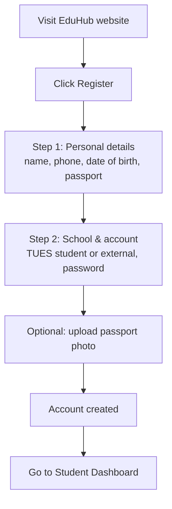
```mermaid
flowchart TD
    A[Visit EduHub website] --> B[Click Register]
    B --> C[Step 1: Personal details<br/>name, phone, date of birth, passport]
    C --> D[Step 2: School & account<br/>TUES student or external, password]
    D --> E[Optional: upload passport photo]
    E --> F[Account created]
    F --> G[Go to Student Dashboard]
```

---

### Student sign in

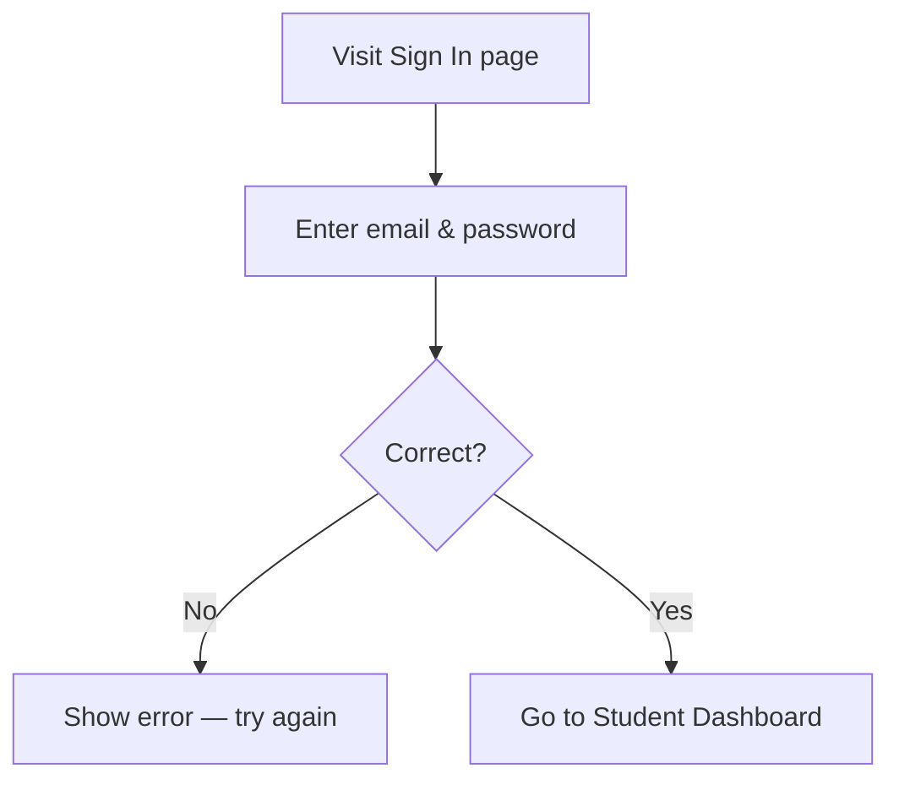
```mermaid
flowchart TD
    A[Visit Sign In page] --> B[Enter email & password]
    B --> C{Correct?}
    C -->|No| D[Show error — try again]
    C -->|Yes| E[Go to Student Dashboard]
```

---

### Teacher account setup

Teachers **cannot** register on the public site. An admin creates their account first.

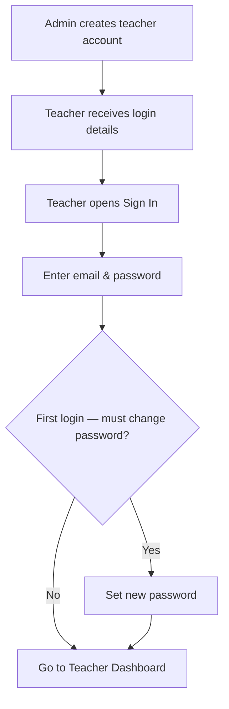
```mermaid
flowchart TD
    A[Admin creates teacher account] --> B[Teacher receives login details]
    B --> C[Teacher opens Sign In]
    C --> D[Enter email & password]
    D --> E{First login — must change password?}
    E -->|Yes| F[Set new password]
    E -->|No| G[Go to Teacher Dashboard]
    F --> G
```

---

### Admin account setup

Same as teacher — admin staff accounts are created by a super admin, not self-registration.

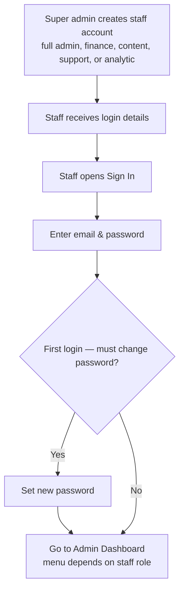
```mermaid
flowchart TD
    A[Super admin creates staff account<br/>full admin, finance, content, support, or analytic]
    B[Staff receives login details]
    C[Staff opens Sign In]
    D[Enter email & password]
    E{First login — must change password?}
    F[Set new password]
    G[Go to Admin Dashboard<br/>menu depends on staff role]

    A --> B --> C --> D --> E
    E -->|Yes| F --> G
    E -->|No| G
```

**Staff types**

| Type | Main focus |
|------|------------|
| Full admin | Everything |
| Finance admin | Payments, payroll, enrollments |
| Content admin | Courses, website, promos |
| Support admin | Students, calendar, support sessions |
| Analytic admin | Reports, analytics |

---

### Forgot password

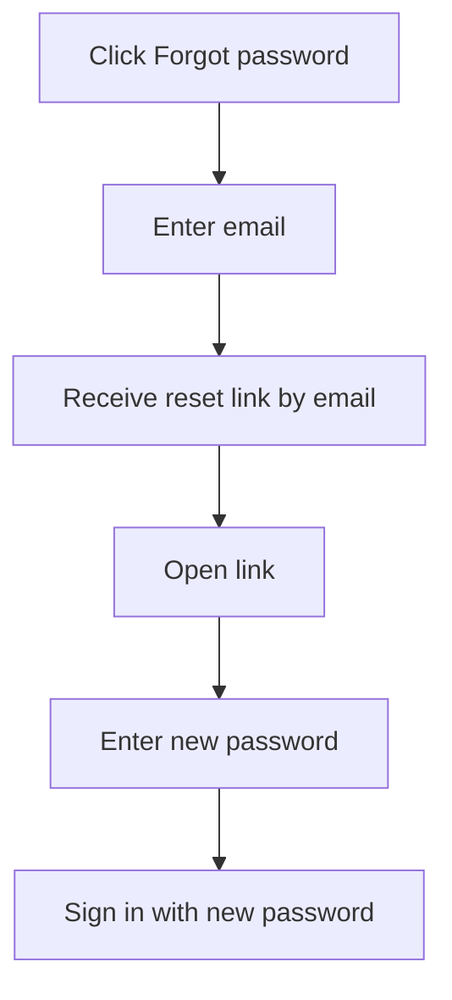
```mermaid
flowchart TD
    A[Click Forgot password] --> B[Enter email]
    B --> C[Receive reset link by email]
    C --> D[Open link]
    D --> E[Enter new password]
    E --> F[Sign in with new password]
```

---

### Verify email

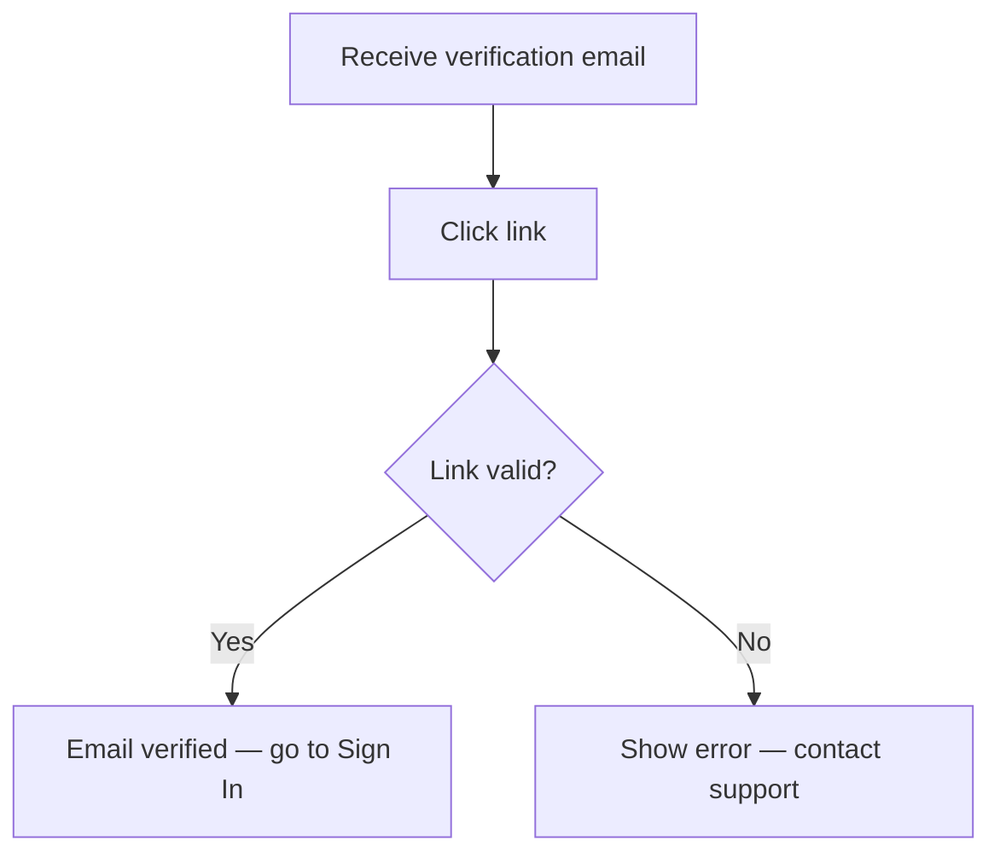
```mermaid
flowchart TD
    A[Receive verification email] --> B[Click link]
    B --> C{Link valid?}
    C -->|Yes| D[Email verified — go to Sign In]
    C -->|No| E[Show error — contact support]
```

---

## Student

### Student enroll in a class

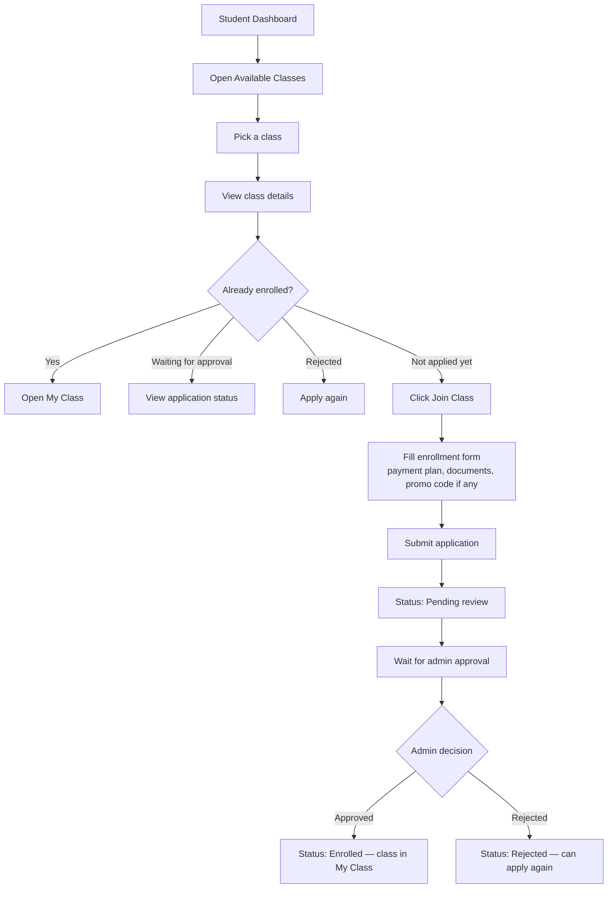
```mermaid
flowchart TD
    A[Student Dashboard] --> B[Open Available Classes]
    B --> C[Pick a class]
    C --> D[View class details]
    D --> E{Already enrolled?}

    E -->|Yes| F[Open My Class]
    E -->|Waiting for approval| G[View application status]
    E -->|Rejected| H[Apply again]
    E -->|Not applied yet| I[Click Join Class]

    I --> J[Fill enrollment form<br/>payment plan, documents, promo code if any]
    J --> K[Submit application]
    K --> L[Status: Pending review]
    L --> M[Wait for admin approval]

    M --> N{Admin decision}
    N -->|Approved| O[Status: Enrolled — class in My Class]
    N -->|Rejected| P[Status: Rejected — can apply again]
```

---

### Student pay tuition

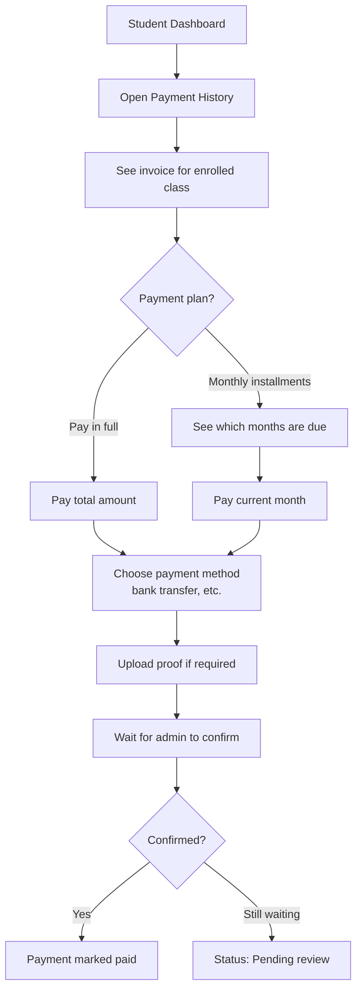
```mermaid
flowchart TD
    A[Student Dashboard] --> B[Open Payment History]
    B --> C[See invoice for enrolled class]
    C --> D{Payment plan?}

    D -->|Pay in full| E[Pay total amount]
    D -->|Monthly installments| F[See which months are due]

    E --> G[Choose payment method<br/>bank transfer, etc.]
    F --> H[Pay current month]
    H --> G

    G --> I[Upload proof if required]
    I --> J[Wait for admin to confirm]
    J --> K{Confirmed?}
    K -->|Yes| L[Payment marked paid]
    K -->|Still waiting| M[Status: Pending review]
```

---

### Student attend class

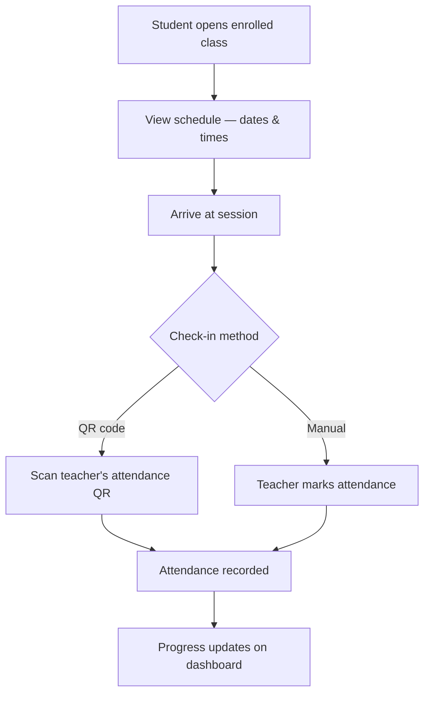
```mermaid
flowchart TD
    A[Student opens enrolled class] --> B[View schedule — dates & times]
    B --> C[Arrive at session]
    C --> D{Check-in method}

    D -->|QR code| E[Scan teacher's attendance QR]
    D -->|Manual| F[Teacher marks attendance]

    E --> G[Attendance recorded]
    F --> G
    G --> H[Progress updates on dashboard]
```

---

### Student learn & complete course

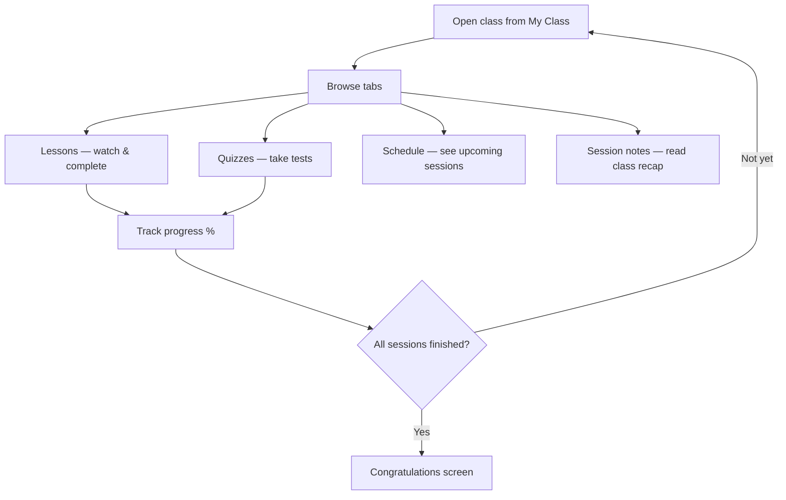
```mermaid
flowchart TD
    A[Open class from My Class] --> B[Browse tabs]

    B --> C[Lessons — watch & complete]
    B --> D[Quizzes — take tests]
    B --> E[Schedule — see upcoming sessions]
    B --> F[Session notes — read class recap]

    C --> G[Track progress %]
    D --> G

    G --> H{All sessions finished?}
    H -->|Not yet| A
    H -->|Yes| I[Congratulations screen]
```

---

### Student get certificate

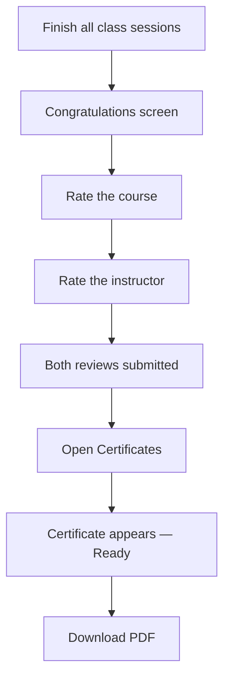
```mermaid
flowchart TD
    A[Finish all class sessions] --> B[Congratulations screen]
    B --> C[Rate the course]
    C --> D[Rate the instructor]
    D --> E[Both reviews submitted]
    E --> F[Open Certificates]
    F --> G[Certificate appears — Ready]
    G --> H[Download PDF]
```

---

## Teacher

### Teacher create a class

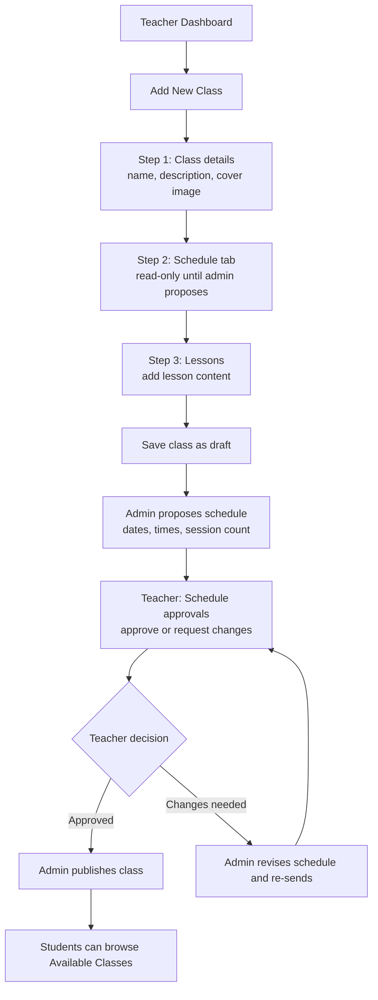
```mermaid
flowchart TD
    A[Teacher Dashboard] --> B[Add New Class]
    B --> C[Step 1: Class details<br/>name, description, cover image]
    C --> D[Step 2: Schedule tab<br/>read-only until admin proposes]
    D --> E[Step 3: Lessons<br/>add lesson content]
    E --> F[Save class as draft]

    F --> G[Admin proposes schedule<br/>dates, times, session count]
    G --> H[Teacher: Schedule approvals<br/>approve or request changes]
    H --> I{Teacher decision}
    I -->|Approved| J[Admin publishes class]
    J --> K[Students can browse Available Classes]
    I -->|Changes needed| L[Admin revises schedule and re-sends]
    L --> H
```

**Class status (simple)**

```
Draft → Schedule pending (teacher) → Schedule approved → Published → (students can join)
```

**Who does what**

| Step | Who | Sidebar page |
|------|-----|--------------|
| Create class details + lessons | Teacher | Class › Add New Class |
| Propose session dates & times | Admin | Classes › All classes & schedules › Schedule |
| Approve or request changes | Teacher | Schedule approvals |
| Publish to catalog | Admin | Classes › All classes & schedules |

---

### Teacher teach a class

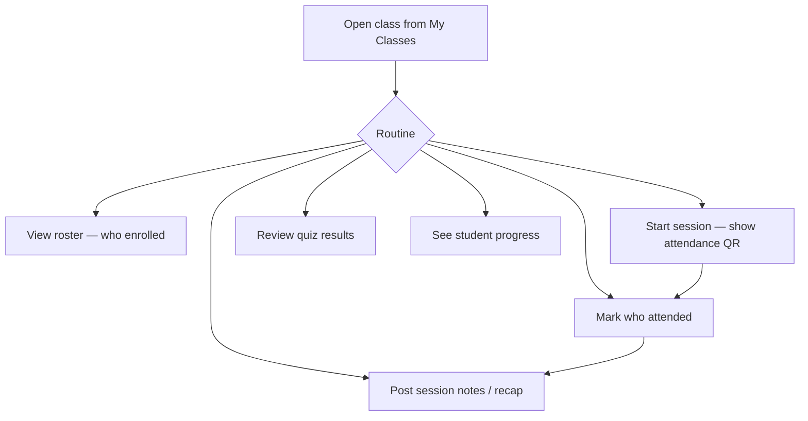
```mermaid
flowchart TD
    A[Open class from My Classes] --> B{Routine}

    B --> C[View roster — who enrolled]
    B --> D[Start session — show attendance QR]
    B --> E[Mark who attended]
    B --> F[Post session notes / recap]
    B --> G[Review quiz results]
    B --> H[See student progress]

    D --> E
    E --> F
```

---

### Teacher request payroll

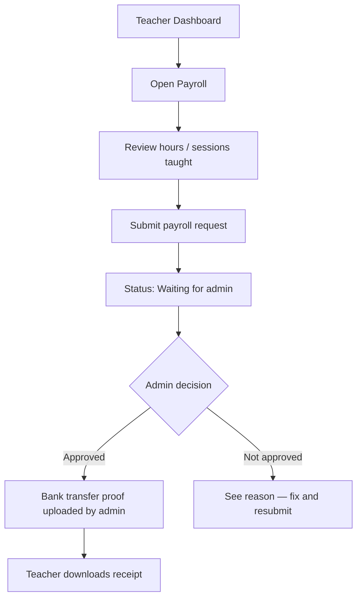
```mermaid
flowchart TD
    A[Teacher Dashboard] --> B[Open Payroll]
    B --> C[Review hours / sessions taught]
    C --> D[Submit payroll request]
    D --> E[Status: Waiting for admin]
    E --> F{Admin decision}
    F -->|Approved| G[Bank transfer proof uploaded by admin]
    G --> H[Teacher downloads receipt]
    F -->|Not approved| I[See reason — fix and resubmit]
```

---

### Teacher substitute cover

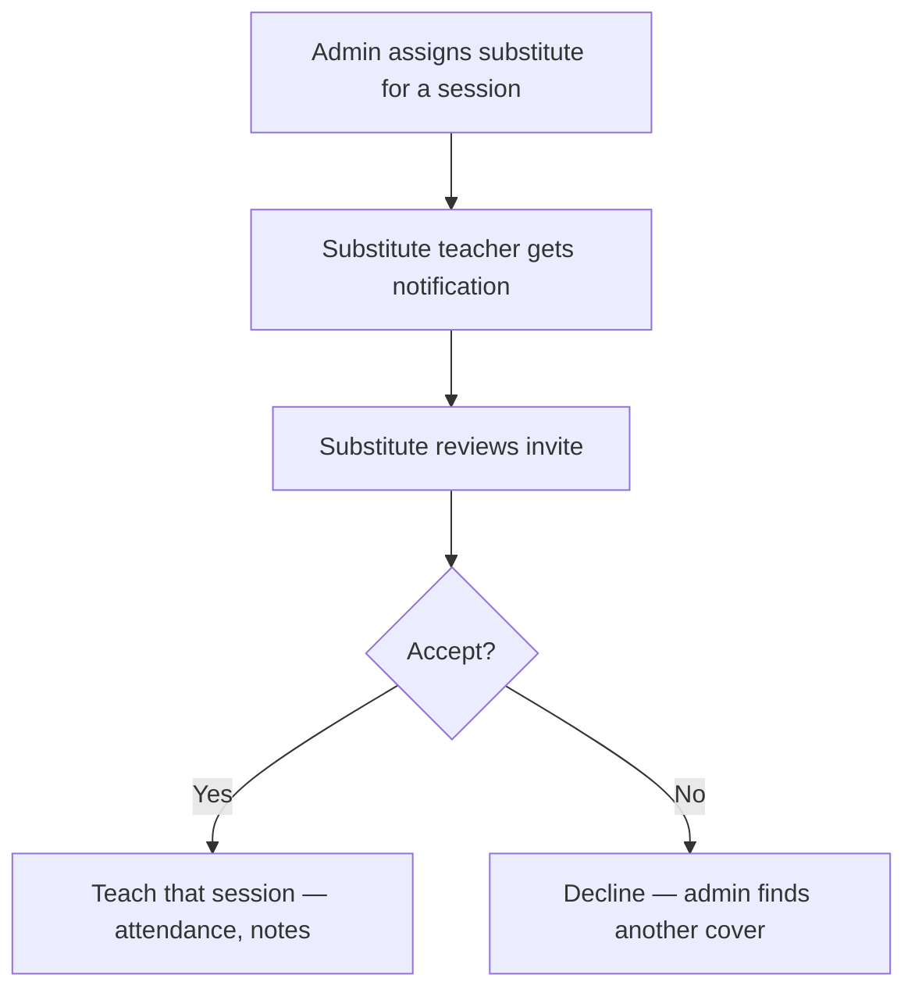
```mermaid
flowchart TD
    A[Admin assigns substitute for a session] --> B[Substitute teacher gets notification]
    B --> C[Substitute reviews invite]
    C --> D{Accept?}
    D -->|Yes| E[Teach that session — attendance, notes]
    D -->|No| F[Decline — admin finds another cover]
```

---

## Admin

### Admin approve enrollment

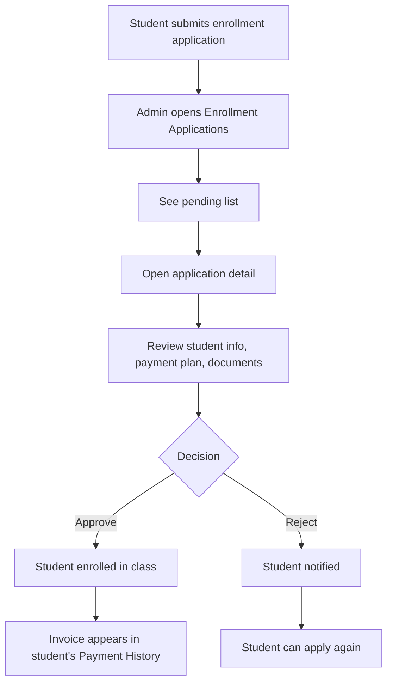
```mermaid
flowchart TD
    A[Student submits enrollment application] --> B[Admin opens Enrollment Applications]
    B --> C[See pending list]
    C --> D[Open application detail]
    D --> E[Review student info, payment plan, documents]
    E --> F{Decision}

    F -->|Approve| G[Student enrolled in class]
    G --> H[Invoice appears in student's Payment History]

    F -->|Reject| I[Student notified]
    I --> J[Student can apply again]
```

---

### Admin propose class schedule

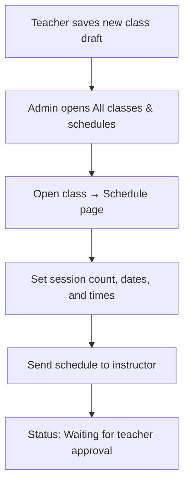
```mermaid
flowchart TD
    A[Teacher saves new class draft] --> B[Admin opens All classes & schedules]
    B --> C[Open class → Schedule page]
    C --> D[Set session count, dates, and times]
    D --> E[Send schedule to instructor]
    E --> F[Status: Waiting for teacher approval]
```

---

### Teacher approve class schedule

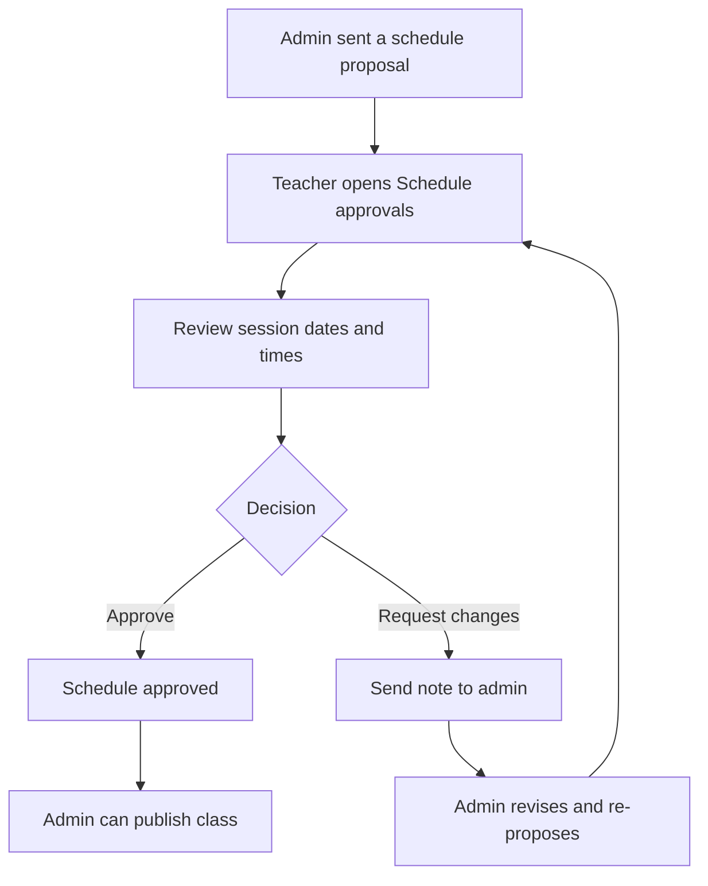
```mermaid
flowchart TD
    A[Admin sent a schedule proposal] --> B[Teacher opens Schedule approvals]
    B --> C[Review session dates and times]
    C --> D{Decision}

    D -->|Approve| E[Schedule approved]
    E --> F[Admin can publish class]

    D -->|Request changes| G[Send note to admin]
    G --> H[Admin revises and re-proposes]
    H --> B
```

---

### Admin manage payments

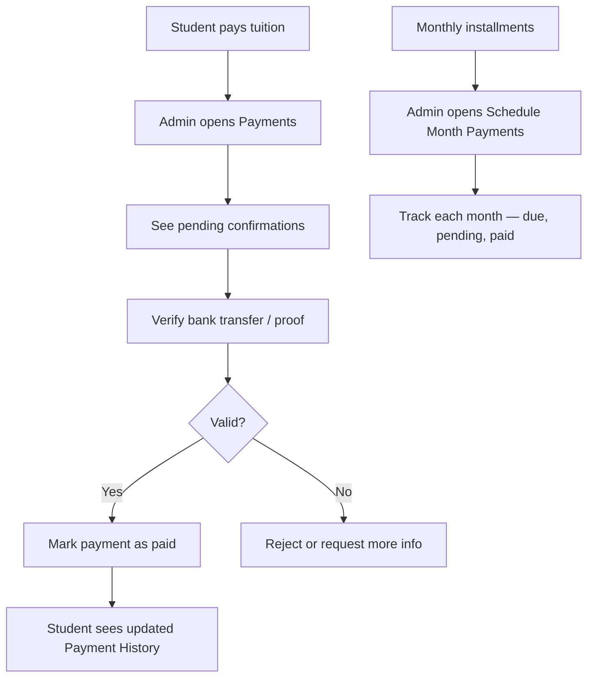
```mermaid
flowchart TD
    A[Student pays tuition] --> B[Admin opens Payments]
    B --> C[See pending confirmations]
    C --> D[Verify bank transfer / proof]
    D --> E{Valid?}

    E -->|Yes| F[Mark payment as paid]
    F --> G[Student sees updated Payment History]

    E -->|No| H[Reject or request more info]

    I[Monthly installments] --> J[Admin opens Schedule Month Payments]
    J --> K[Track each month — due, pending, paid]
```

---

### Admin approve payroll

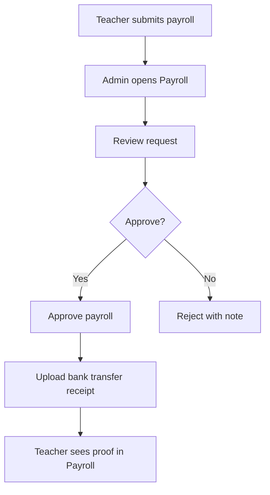
```mermaid
flowchart TD
    A[Teacher submits payroll] --> B[Admin opens Payroll]
    B --> C[Review request]
    C --> D{Approve?}

    D -->|Yes| E[Approve payroll]
    E --> F[Upload bank transfer receipt]
    F --> G[Teacher sees proof in Payroll]

    D -->|No| H[Reject with note]
```

---

## Full journey (all roles)

How one class goes from idea to certificate — all three roles together.

```mermaid
sequenceDiagram
    participant S as Student
    participant T as Teacher
    participant A as Admin

    Note over T: Teacher creates class (details + lessons)
    Note over A: Admin proposes schedule
    A->>T: Schedule sent for review
    Note over T: Teacher approves on Schedule approvals
    T->>A: Schedule approved
    Note over A: Admin publishes class
    S->>S: Register + sign in
    S->>S: Apply to class (enrollment form)
    A->>A: Review enrollment application
    A->>S: Approve → enrolled
    S->>S: Pay tuition / attend sessions / do lessons
    T->>T: Take attendance (QR), manage roster
    S->>S: Complete course + submit reviews
    S->>S: Download certificate
    T->>A: Submit payroll
    A->>T: Approve payroll + send proof
```

**In order:**

1. Teacher creates class (details + lessons)  
2. Admin proposes schedule (dates, times, sessions)  
3. Teacher approves on **Schedule approvals** (or requests changes)  
4. Admin publishes class → live in Available Classes  
5. Student registers and applies  
6. Admin approves enrollment  
7. Student pays tuition  
8. Student attends sessions; teacher takes attendance  
9. Student finishes lessons and quizzes  
10. Student leaves reviews → downloads certificate  
11. Teacher submits payroll → admin approves and sends proof  

> **More sequence diagrams:** [flow-map.md](./flow-map.md)

---

*EduHub — Termez University of Economics and Service (TUES)*
